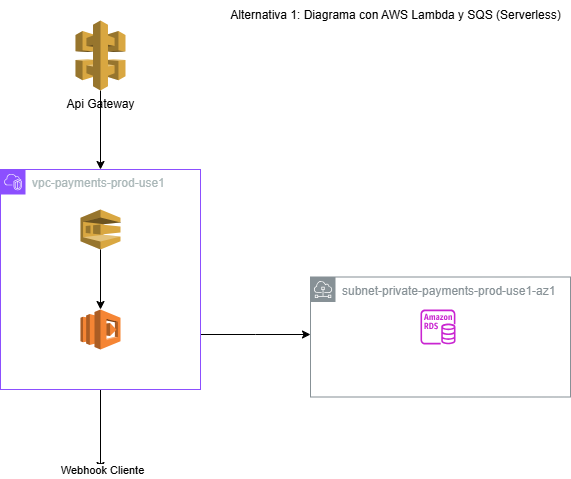
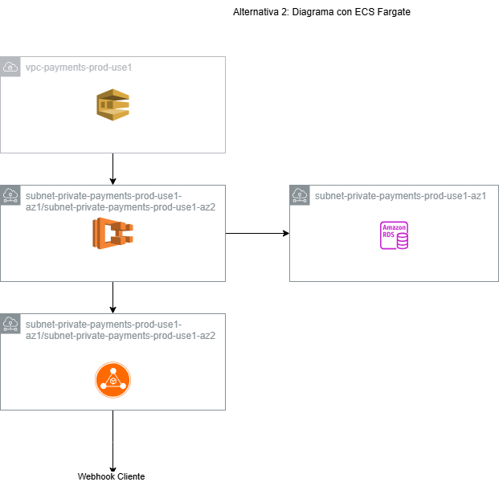

# Diagramas de la Solución DevOps para ePayco

En esta carpeta se encuentran los diagramas arquitectónicos de las dos alternativas propuestas para resolver el problema de confirmación de transacciones en ePayco. A continuación, se explica cada diagrama en detalle.

---

## Alternativa 1: Arquitectura Serverless (Lambda + SQS)

### Diagrama: `alternativa1.png`

### Descripción de la Arquitectura

1. **API Gateway**:
   - Recibe las transacciones entrantes desde los clientes.
   - Expone un endpoint público para recibir las solicitudes.

2. **Amazon SQS**:
   - Almacena las transacciones pendientes de confirmación en una cola.
   - Garantiza que las transacciones no se pierdan y se procesen en orden.

3. **AWS Lambda**:
   - Procesa las transacciones desde SQS.
   - Ejecuta la lógica de confirmación de transacciones.
   - Marca las transacciones como procesadas en la base de datos.

4. **Amazon RDS**:
   - Almacena las transacciones y su estado (pendiente, confirmada, fallida).
   - Proporciona persistencia de datos.

5. **Webhook del Cliente**:
   - Destino final de las confirmaciones de transacciones.
   - Recibe las confirmaciones enviadas por Lambda.

6. **Amazon CloudWatch**:
   - Monitorea el rendimiento de Lambda, SQS y RDS.
   - Genera alertas en caso de errores o cuellos de botella.

7. **AWS X-Ray**:
   - Proporciona trazabilidad del flujo de transacciones.
   - Ayuda a depurar y optimizar el sistema.

### Flujo de Trabajo

1. Las transacciones llegan a **API Gateway**.
2. API Gateway las envía a **SQS**.
3. **Lambda** consume las transacciones desde SQS y las procesa.
4. Lambda actualiza el estado de las transacciones en **RDS**.
5. Lambda envía las confirmaciones al **Webhook del Cliente**.
6. **CloudWatch** y **X-Ray** monitorean y rastrean todo el proceso.

---

## Alternativa 2: Arquitectura con ECS Fargate

### Diagrama: `alternativa2.png`

### Descripción de la Arquitectura

1. **Amazon SQS**:
   - Almacena las transacciones pendientes de confirmación en una cola.
   - Garantiza que las transacciones no se pierdan y se procesen en orden.

2. **Amazon ECS Fargate**:
   - Ejecuta contenedores que procesan las transacciones desde SQS.
   - Escala automáticamente según la carga de trabajo.

3. **Application Load Balancer (ALB)**:
   - Distribuye la carga entre los contenedores de ECS Fargate.
   - Expone un endpoint público para recibir transacciones.

4. **Amazon RDS**:
   - Almacena las transacciones y su estado (pendiente, confirmada, fallida).
   - Proporciona persistencia de datos.

5. **Webhook del Cliente**:
   - Destino final de las confirmaciones de transacciones.
   - Recibe las confirmaciones enviadas por ECS Fargate.

6. **Amazon CloudWatch**:
   - Monitorea el rendimiento de ECS Fargate, SQS y RDS.
   - Genera alertas en caso de errores o cuellos de botella.

7. **AWS X-Ray**:
   - Proporciona trazabilidad del flujo de transacciones.
   - Ayuda a depurar y optimizar el sistema.

### Flujo de Trabajo

1. Las transacciones llegan a **SQS**.
2. **ECS Fargate** consume las transacciones desde SQS y las procesa.
3. ECS Fargate actualiza el estado de las transacciones en **RDS**.
4. ECS Fargate envía las confirmaciones al **Webhook del Cliente**.
5. **CloudWatch** y **X-Ray** monitorean y rastrean todo el proceso.

---

## Comparación de las Alternativas

| Característica              | Alternativa 1 (Serverless)       | Alternativa 2 (ECS Fargate)     |
|-----------------------------|----------------------------------|----------------------------------|
| **Escalabilidad**           | Escalado automático (Lambda)     | Escalado automático (ECS)       |
| **Costo**                   | Pago por uso (más económico)     | Costo fijo por contenedores     |
| **Complejidad**             | Baja (sin gestión de servidores) | Media (gestión de contenedores) |
| **Tiempo de Respuesta**     | Rápido (Lambda)                 | Depende de la configuración     |
| **Uso Recomendado**         | Cargas variables y ligeras       | Cargas constantes y pesadas     |

---

## Notas Adicionales

- Los diagramas fueron creados usando [AWS Architecture Icons](https://aws.amazon.com/architecture/icons/).
- Para modificar los diagramas, se recomienda usar herramientas como **Lucidchart** o **Draw.io**.